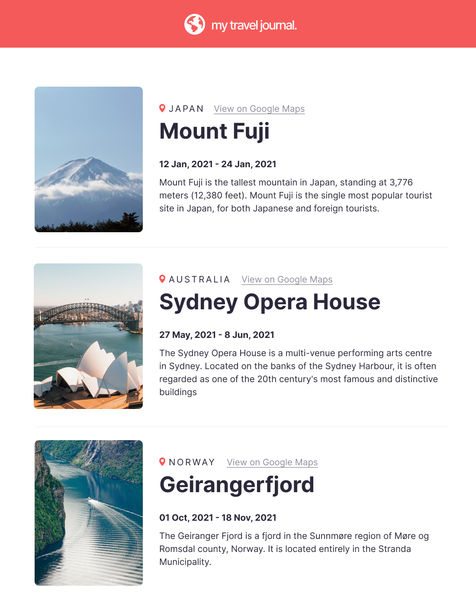

# React Components and Props Challenge :

	In this challenge, i have learned how to us React Props by creating a simple travel page.

# First:-- make sure that you have install vite-react, nodeJs, npm.

# Then :-- $ npm run dev

